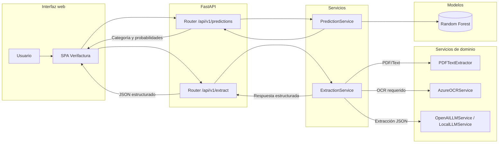

# Arquitectura de Verifactura

## Tipo de modelo seleccionado y justificación
- **Extracción semántica:** se apoya en modelos de lenguaje grandes (LLM) accesibles vía API de OpenAI (`gpt-5-mini` por defecto) o mediante pesos abiertos ejecutados con HuggingFace Transformers. Los LLM son idóneos para interpretar textos semi estructurados de facturas y mapearlos a un esquema JSON rígido.
- **Clasificación vehicular:** utiliza un **Random Forest** entrenado con características tabulares (marca, tipo, clase, capacidad, combustible, ruedas y total). Este algoritmo ofrece robustez ante outliers, interpretabilidad relativa y buen rendimiento con datasets medianos.

## Arquitectura detallada
| Capa | Componentes | Detalles relevantes |
| --- | --- | --- |
| Presentación | `main.py`, `app/routes/*`, plantilla `app/templates/index.html` | FastAPI expone endpoints REST y sirve la interfaz SPA. Los routers `extract.py`, `predictions.py` y `ui.py` definen contratos Pydantic y validaciones.
| Servicios de aplicación | `ExtractionService`, `PredictionService`, `TrainingService` | Coordinan OCR, lectura de PDF, llamadas a LLM y manejo del modelo Random Forest persistido en `verifactura_rf_model.pkl`.
| Servicios de dominio | `PDFTextExtractor`, `AzureOCRService`, `OpenAILLMService`, `LocalLLMService` | Implementan reglas específicas: extracción de texto, renderizado de páginas, integración con Azure Form Recognizer y ejecución local de modelos.
| Persistencia y modelos | `train/random_forest.py`, carpeta `models/` | Define el pipeline de entrenamiento, serialización con joblib y almacenamiento de pesos locales.

### Hiperparámetros clave del Random Forest
- `n_estimators=400`, `max_depth=15`, `max_features=0.6`, `min_samples_split=5`, `min_samples_leaf=3`, `max_samples=0.8`, `bootstrap=True`.
- Preprocesamiento con `ColumnTransformer`: `OneHotEncoder` para variables categóricas y `StandardScaler` para numéricas.

## Diagrama de flujo del sistema completo


## Pipeline de datos (desde input hasta output)
1. **Ingreso**: usuario pega texto, sube archivo o arrastra múltiples documentos en la interfaz.
2. **Validación**: routers FastAPI (`extract.py`, `predictions.py`) normalizan parámetros, validan tipos y detectan extensiones soportadas.
3. **Lectura/OCR**: `PDFTextExtractor` intenta leer texto incrustado; si falla o se trata de imagen/PDF escaneado, `AzureOCRService` invoca `prebuilt-read` para generar texto.
4. **Inferencia LLM**: `ExtractionService` divide el texto en fragmentos, selecciona `OpenAILLMService` o `LocalLLMService` según proveedor y obtiene JSON conforme al esquema `INVOICE_SCHEMA`.
5. **Clasificación tabular**: cuando se solicita, `PredictionService` reordena las características y consulta el modelo Random Forest serializado.
6. **Respuesta**: FastAPI empaqueta `fields`, `raw_text`, `text_origin`, métricas de predicción y posibles advertencias en formato JSON para la UI.

## Tecnologías y librerías utilizadas con versiones
Las versiones completas están definidas en `requirements.txt`. Destacan:
- **FastAPI 0.110.0** y **Uvicorn 0.27.1** para el backend asíncrono.
- **OpenAI 1.17.0** para el cliente oficial de la API de LLM.
- **Transformers 4.39.3** y **PyTorch 2.2.1** para ejecución local de modelos; si se dispone de GPU NVIDIA puede instalarse la variante CUDA con:
  ```bash
  pip install torch torchvision torchaudio --index-url https://download.pytorch.org/whl/cu121
  ```
- **PyPDF2 3.0.1**, **pdf2image 1.17.0** y **PyMuPDF 1.23.26** para el procesamiento de PDF.
- **Azure AI Form Recognizer 3.3.0** para OCR basado en la nube.
- **Pandas 2.2.1**, **Scikit-learn 1.4.1.post1** y **Joblib 1.3.2** para el pipeline tabular y la persistencia del Random Forest.
- **Jinja2 3.1.3** y **HTTPX 0.27.0** para renderizado de la interfaz y pruebas.
