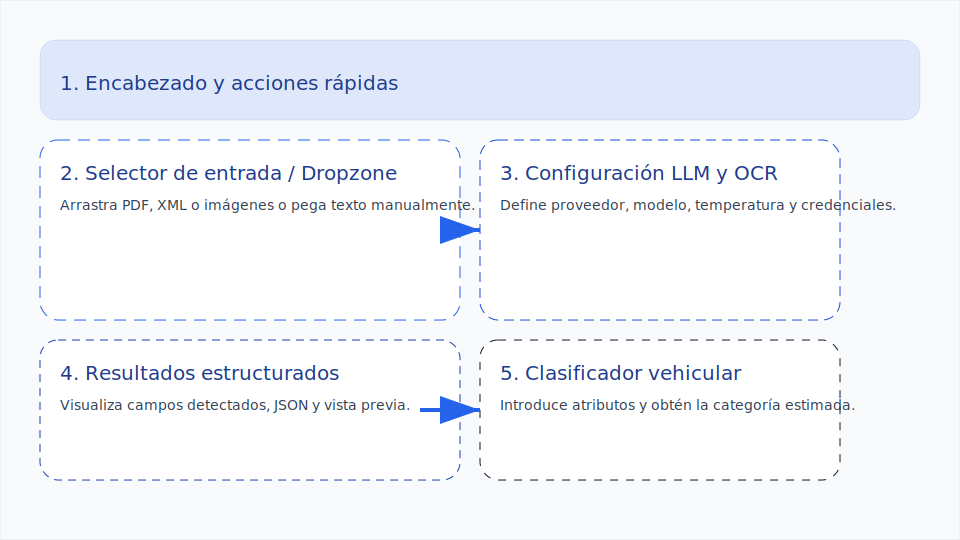

# Manual de usuario de Verifactura

## Guía paso a paso para usar la interfaz
1. **Ingresar a la plataforma**
   - Abre `http://localhost:8000` después de iniciar el servidor con `uvicorn`.
2. **Elegir el modo de captura**
   - *Texto*: pega directamente el contenido completo de la factura.
   - *Archivo*: selecciona un PDF, XML o JSON; marca **Forzar OCR** si es un PDF escaneado.
   - *Lote*: agrega varios archivos y revisa el estado de cada uno en la lista.
3. **Configurar parámetros opcionales del LLM** (modo desarrollador)
   - Proveedor (`api` o `local`), modelo, temperatura, `top_p`, esfuerzo de razonamiento y penalizaciones.
   - Clave temporal de OpenAI si deseas usar una diferente a la definida en `.env`.
4. **Configurar OCR (si aplica)**
   - Selecciona Azure como proveedor y opcionalmente sobrescribe endpoint/clave para la sesión.
5. **Enviar la solicitud**
   - Presiona **Procesar** y espera el estado `Extracción completa` en el panel de resultados.
6. **Revisar y exportar**
   - Navega entre pestañas para ver los campos normalizados, el JSON crudo o la vista previa del archivo.
   - Usa **Descargar JSON** para guardar la respuesta.
7. **Clasificar vehículo**
   - Completa el formulario del módulo *Clasificador vehicular* y haz clic en **Calcular categoría**.
8. **Reiniciar la sesión**
   - Pulsa **Restablecer** para limpiar archivos, texto y resultados.

## Capturas de pantalla anotadas

1. **Encabezado y acciones rápidas**: acceso a modo desarrollador, restablecer y enlaces de ayuda.
2. **Selector de entrada / Dropzone**: cambia entre texto, archivo único o lote; acepta arrastrar y soltar.
3. **Configuración LLM y OCR**: parámetros avanzados para OpenAI o modelo local y credenciales temporales.
4. **Resultados estructurados**: muestra campos extraídos, JSON, resumen y vista previa descargable.
5. **Clasificador vehicular**: formulario para obtener la etiqueta estimada y probabilidades del Random Forest.

## Explicación de cada funcionalidad
### Extracción asistida por LLM
Envía texto o archivos y recibe un JSON que cumple el esquema `INVOICE_SCHEMA`. Se puede alternar entre OpenAI y un modelo local cargado con Transformers.

### Procesamiento por lotes
La pestaña *Lote* permite colas de múltiples archivos. Cada elemento muestra progreso, errores y enlaces a la vista previa.

### Parámetros avanzados
En modo desarrollador se exponen controles para temperatura, `top_p`, esfuerzo de razonamiento y claves API temporales.

### Integración OCR
Los archivos escaneados utilizan Azure Form Recognizer. Es posible forzar OCR y definir endpoint/clave por solicitud.

### Clasificador vehicular
El módulo inferior toma los campos clave y consulta el Random Forest serializado en `verifactura_rf_model.pkl`, retornando clase y distribución de probabilidades.

### Exportación y registros
Los resultados pueden descargarse como JSON o copiarse al portapapeles. Los errores se muestran en un panel dedicado con sugerencias.

## Troubleshooting (problemas comunes y soluciones)
- **No aparece la vista previa del archivo**: verifica que el navegador permita abrir ventanas modales y que el archivo no exceda 15 MB.
- **Error de Azure OCR no configurado**: agrega `AZURE_FORM_RECOGNIZER_ENDPOINT` y `AZURE_FORM_RECOGNIZER_KEY` al `.env` o proporciona valores en la sección OCR.
- **El modelo local responde vacío**: asegúrate de que los pesos estén en `models/` o define `LOCAL_LLM_MODEL_ID`; revisa que PyTorch pueda detectar GPU o CPU según corresponda.
- **Fallo al clasificar**: confirma que `verifactura_rf_model.pkl` exista y que `pandas`, `scikit-learn` y `joblib` estén instalados (ver `requirements.txt`).

## Preguntas frecuentes (FAQ)
- **¿Puedo usar otro modelo de OpenAI?** Sí, ingresa el nombre en *Modelo* o actualiza `OPENAI_MODEL` en `.env`.
- **¿Qué formatos de archivo se aceptan?** PDF, XML, JSON y, mediante el endpoint de imágenes, PNG/JPG/TIFF.
- **¿Cómo actualizo el modelo Random Forest?** Ejecuta `python -m train.random_forest` con un CSV en `train/data/` y reinicia el servicio.
- **¿Es obligatorio Azure para OCR?** Solo para imágenes o PDFs sin texto embebido; de lo contrario, se usará lectura directa con PyPDF2.

## Información de contacto para soporte
- **Incidencias técnicas:** abre un issue en el repositorio `Verifactura` detallando pasos para replicar.
- **Consultas funcionales:** escribe a `soporte@verifactura.local` con la versión de la API y registros relevantes.
- **Actualizaciones y roadmap:** revisa el archivo `META_ARCHITECTURE.md` o la wiki interna del proyecto.
